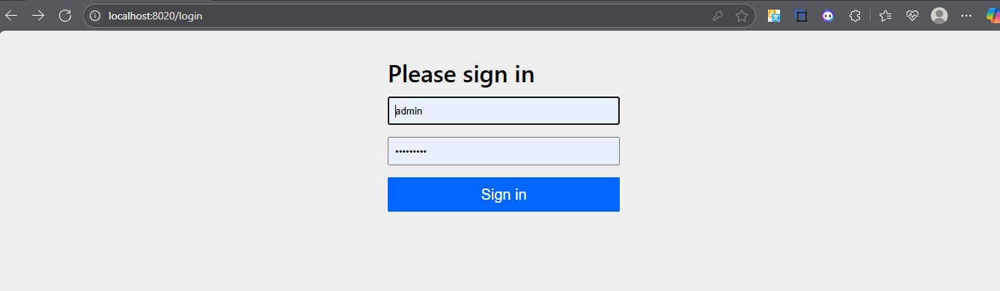

# 🌟 Gestion des Produits

&#x20;

*Application web Spring Boot MVC + Thymeleaf pour gérer un catalogue de produits avec sécurité et validation.*

---

## 📝 Table des matières

1. [Présentation](#présentation)
2. [Fonctionnalités](#fonctionnalités)
3. [Capture d'écran](#capture-décran)
4. [Prérequis](#prérequis)
5. [Installation & configuration](#installation--configuration)
6. [Démarrage](#démarrage)
7. [Utilisation](#utilisation)
8. [Endpoints REST](#endpoints-rest)
9. [Structure du projet](#structure-du-projet)
10. [Utilisateurs par défaut](#utilisateurs-par-défaut)

---

## 📦 Présentation

Cette application permet de :

- Lister, rechercher, ajouter, modifier et supprimer des produits.
- Gérer deux rôles : `ROLE_USER` (lecture seule) et `ROLE_ADMIN` (CRUD complet).
- Valider les données serveur et client (Bootstrap + Spring Validation).
- Protéger les accès avec Spring Security et stocker les utilisateurs dans PostgreSQL.

---

## 🛠️ Fonctionnalités

- **Liste des produits** : affichage paginé, formatage des prix et quantités.
- **Recherche** : filtre par nom de produit (contient, insensible à la casse).
- **Ajout / Modification** : formulaire unique pour création et mise à jour.
- **Suppression** : confirmation avec `confirm()`.
- **Validation** : messages d’erreur clairs et stylés Bootstrap.
- **Sécurité** :
    - Page de connexion personnalisée.
    - Affichage conditionnel (`sec:authorize`) des boutons.
    - Formulaire de déconnexion avec CSRF.
- **Responsive** : design mobile-friendly.

---

## 🖼️ Capture d’écran




---

## ⚙️ Prérequis

- **Java 17** ou supérieur
- **Maven** ou **Gradle**
- **PostgreSQL** (ou H2 pour du dev rapide)

---

## 🚀 Installation & configuration

1. **Cloner le dépôt** :

   ```bash
   git clone https://github.com/votre-utilisateur/gestion-produits.git
   cd gestion-produits
   ```

2. **Configurer** la base de données dans `src/main/resources/application.yml` :

   ```yaml
   spring:
     datasource:
       url: jdbc:postgresql://localhost:5432/products_db
       username: postgres
       password: root
     jpa:
       hibernate:
         ddl-auto: update
       database-platform: org.hibernate.dialect.PostgreSQLDialect
     sql:
       init:
         mode: always
     
   ```

3. **Initialiser** la base (si non auto-init) :

   ```bash
   psql -U postgres -c "CREATE DATABASE products_db;"
   psql -U postgres -d products_db -f schema.sql
   ```

---

## ▶️ Démarrage

- **Gradle** :

  ```bash
  ./gradlew bootRun
  ```

Accéder à l’application : `http://localhost:8020/products/all`

---

## 💻 Utilisation

1. **Se connecter** via la page **/login**.
2. **Lister** ou **rechercher** des produits.
3. En tant qu’**ADMIN**, **ajouter**, **modifier**, **supprimer**.
4. **Se déconnecter** via le menu utilisateur.

---

## 📡 Endpoints REST

| Méthode | URL                           | Description                    |
| ------- | ----------------------------- | ------------------------------ |
| GET     | `/products/all`               | Liste tous les produits        |
| GET     | `/products/admin/add`         | Formulaire ajout               |
| POST    | `/products/admin/save`        | Enregistrer création/modif     |
| GET     | `/products/admin/update/{id}` | Formulaire modification        |
| GET     | `/products/admin/delete/{id}` | Supprimer un produit (confirm) |

---

## 📂 Structure du projet

```
src/main/java/
└─ ma.bdcc.springmvc
   ├─ config (SecurityConfig, WebMvcConfig)
   ├─ entities (Product)
   ├─ repository (ProductRepo)
   ├─ security (JdbcUserDetailsManager config)
   └─ web (controllers, templates)
```

---

## 👥 Utilisateurs par défaut

| Nom d’utilisateur | Mot de passe | Rôle        |
| ----------------- | ------------ | ----------- |
| `user`            | `password`   | ROLE\_USER  |
| `admin`           | `adminpass`  | ROLE\_ADMIN |

---
